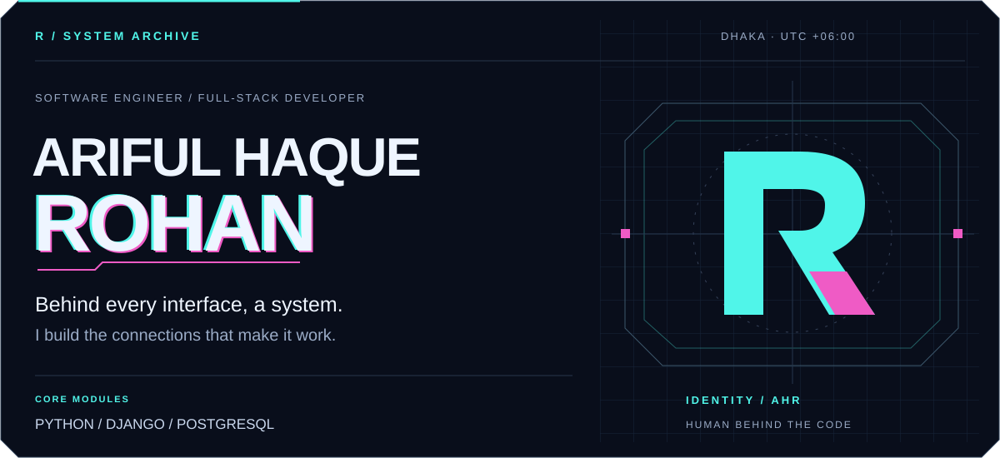
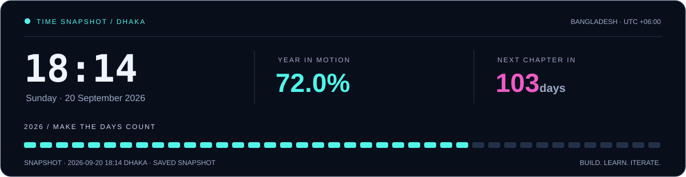
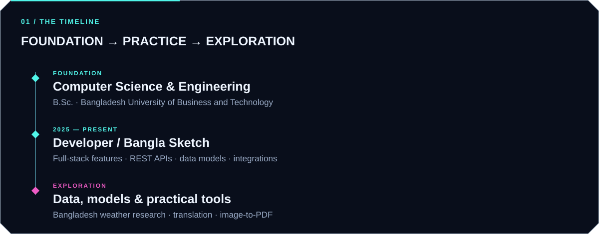
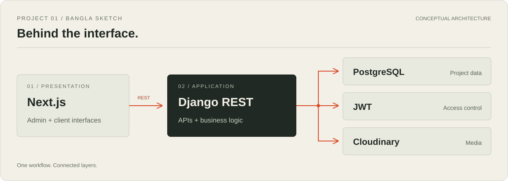

  
    
  <a href="https://github.com/arifulhaquerohan?tab=repositories"><strong>Explore my code ↗</strong></a>
  &nbsp;&nbsp; / &nbsp;&nbsp;
  <a href="mailto:arifulhaquerohan@gmail.com"><strong>Get in touch ↗</strong></a>

 

Time is a scheduled snapshot in Asia/Dhaka (UTC+06:00). GitHub Actions runs hourly; updates and image caching can be delayed.

 

### `00` / Human behind the system

I'm **Ariful Haque Rohan**, a software engineer based in **Dhaka, Bangladesh**. I build across the stack, with a particular interest in the work behind the interface: APIs, data models, and systems that make a product useful.

My toolkit centers on **Python, Django, and PostgreSQL**, with **React and Next.js** on the frontend. I also explore practical machine learning, especially when it connects to local, real-world data.

**Experience** &nbsp; Developer at Bangla Sketch · since 2025  
**Education** &nbsp; B.Sc. in Computer Science & Engineering · BUBT

 

 

### `01` / Project archive

#### Bangla Sketch ↗
**Business software for an interior design workflow.**

Full-stack work spanning project tracking, admin and client access, and media management. My contributions cover REST endpoints, database models, interfaces, and integrations.

**Next.js · Django REST Framework · PostgreSQL · Cloudinary**  
[View the repository →](https://github.com/arifulhaquerohan/banglasketch)

---

#### Weather prediction in Bangladesh
**Exploring weather patterns through machine learning.**

A study of **3,271 weather records from 2013–2022**, covering rainfall classification and temperature regression. It brings together data preparation, model experimentation, and analysis with Python.

**Python · scikit-learn · pandas · PostgreSQL**

---

#### Small tools, practical problems

| Project | Focus |
| :--- | :--- |
| [**Text File Translator ↗**](https://github.com/arifulhaquerohan/text-file-translator) | Text-file translation |
| [**Image to PDF ↗**](https://github.com/arifulhaquerohan/image_to_pdf_flutter_app) | Image-to-PDF conversion with Flutter |

 

### `02` / How I build

**01 / Understand the workflow** → **02 / Model the data** → **03 / Connect the API** → **04 / Make it usable**

From a database relationship to the screen it powers, I care about how the pieces work together. My projects connect backend engineering, usable interfaces, and practical problems.

 

### `03` / Loaded modules

| Layer | Tools |
| :--- | :--- |
| **APIs & backend** | Python · Django · Django REST Framework |
| **Data & storage** | PostgreSQL · SQL · database design |
| **Web interfaces** | JavaScript · React · Next.js · Tailwind CSS |
| **Development** | Git · Docker · Linux · Cloudinary |
| **Exploration** | C++ · scikit-learn · pandas |

 

### `04` / Open a channel

Have a project involving backend systems, a full-stack product, or an interesting dataset? I'd be glad to talk.

**[arifulhaquerohan@gmail.com ↗](mailto:arifulhaquerohan@gmail.com)**

 

